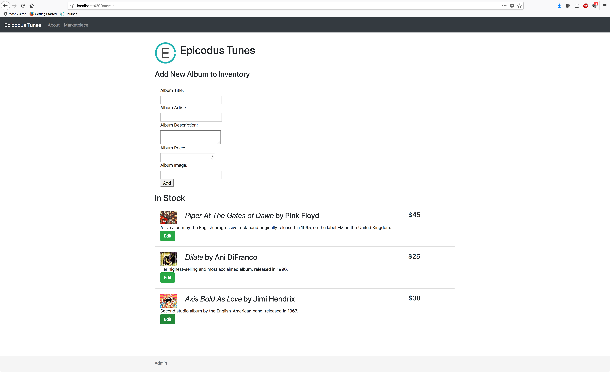
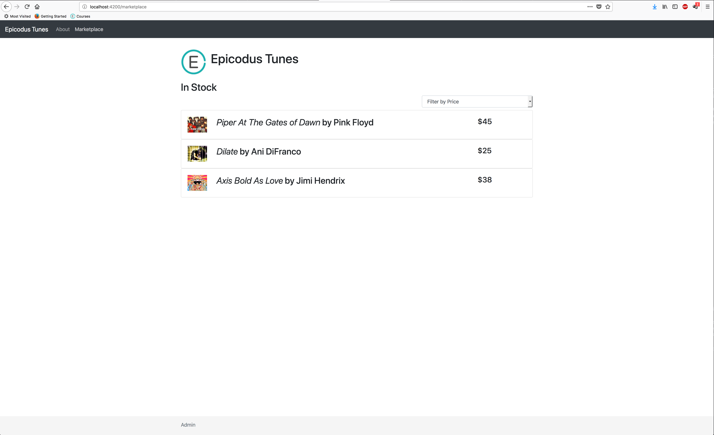

# React Record Store

#### By _**Matt Miller**_

## Description

An app to manage a record store marketplace and inventory. This is a clone. To view original app written with Angular, visit: https://github.com/mattfmiller/record-store-firebase-query

_screenshots of angular site_
 

_Thoughts on React vs Angular:_
 
It has been a while since we worked in Angular at this point so I'm sure I'd have a lot more to say if this was 5 weeks ago. Things that do strike me are that React certainly seems a lot easier to work with in a lot of ways. Passing props seems much easier than the techniques for moving data around components in Angular. It is also convenient to have all of your component code in one single file. I could see this potentially getting messy or confusing, but for now it has been nice. I am not sure yet if I prefer keeping the HTML and JS separated as in Angular or using JSX to combine the two in React, but I do know that I do not love styling in React. The JSX can make it hard to target elements (such as content within Link tags) and passing styles from parents to children doesn't seem to work as expected consistently. I understand the benefits of the virtual DOM and why this makes React so powerful, but for our projects, we aren't really utilizing those benefits so the awkward styling techniques have kinda outweighed those benefits. Also, not sure if I'm sold on the approach of using the view to inform your development process vs BDD/TDD of Angular. Perhaps it's just what I've gotten used to and I guess you would use user stories to inform your design so maybe they aren't as different as they may feel right now.

## Component Structure

## Setup/Installation Requirements
* To view program locally, clone repository from https://github.com/mattfmiller/record-store-react-clone
* In console, navigate to root directory and run `npm install` to install all packages and dependencies
* Run `npm run start` to build program
* Navigate to localhost:8080/ in browser to interact with program

## Known Bugs

* N/A

## Support and contact details

For support, contact: matt.f.miller@live.com

## Technologies Used

* npm
* CSS
* React

## Notes
* In developing my component chart, I realized I am not sure exactly how to indicate that I want to reuse a component (my marketplace) from an admin route with additional features available. I also don't know how this would work in React yet since we haven't reused components in multiple routes (I assume this is fine though) or used branching to show and hide elements in a component like we did in Angular.
* While styling with CSS modules, I am having to employ a lot of redundancy in components that have similar behavior. For example, several of my components have a div with className=container that has a certain rules. These rules are consistent between components, but despite the lesson claiming that rules can be passed from parents to children, when I try to declare this rule at a higher level (in App), it does not seem to be passed down to children components forcing me to rewrite it in each component that needs such a div. Perhaps I am doing something incorrectly, but I haven't been able to figure it out.
* I am unable to target Link tags in my CSS module meaning that I am unable to remove text decoration with this method of styling since targeting anchor tags does not work (even though the DOM renders Link tags as anchor tags).
* When accessing a component through multiple routes, important to remember to pass all props and callback functions through both routes to component. Seems a little redundant, but makes sense.

### License

This software is licensed under the GPL license.

Copyright © 2018 **Matt Miller**
