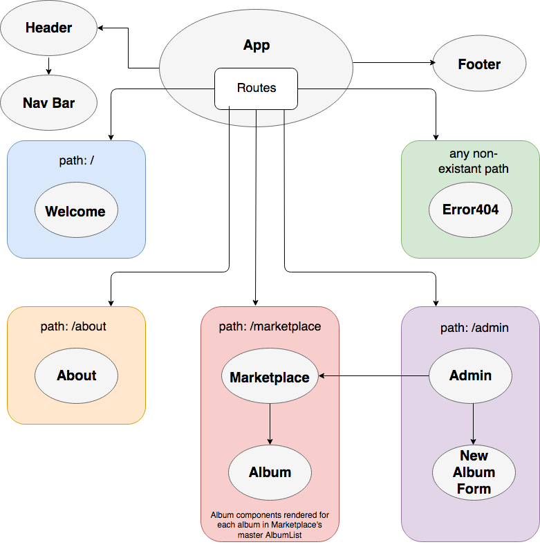

# React Record Store

#### By _**Matt Miller**_

## Description

An app to manage a record store marketplace and inventory.

<!-- #### User Story

A. As a user, I want to ... -->

## Component Structure

## Setup/Installation Requirements
* To view program locally, clone repository from https://github.com/mattfmiller/react-template
* In console, navigate to root directory and run `rm -rf .git` to clear git commit history
* Run `apm install react@0.16.2` to add proper syntax highlights to JSX
* Run `npm install` to install all packages and dependencies
* Run `npm run start` to build program
* Navigate to localhost:8080/ in browser to interact with program

## Known Bugs

* N/A

## Support and contact details

For support, contact: matt.f.miller@live.com

## Technologies Used

* npm
* CSS
* React

## Notes
* In developing my component chart, I realized I am not sure exactly how to indicate that I want to reuse a component (my marketplace) from an admin route with additional features available. I also don't know how this would work in React yet since we haven't reused components in multiple routes (I assume this is fine though) or used branching to show and hide elements in a component like we did in Angular.
* While styling with CSS modules, I am having to employ a lot of redundancy in components that have similar behavior. For example, several of my components have a div with className=container that has a certain rules. These rules are consistent between components, but despite the lesson claiming that rules can be passed from parents to children, when I try to declare this rule at a higher level (in App), it does not seem to be passed down to children components forcing me to rewrite it in each component that needs such a div. Perhaps I am doing something incorrectly, but I haven't been able to figure it out.
* I am unable to target Link tags in my CSS module meaning that I am unable to remove text decoration with this method of styling since targeting anchor tags does not work (even though the DOM renders Link tags as anchor tags).

### License

This software is licensed under the GPL license.

Copyright © 2018 **Matt Miller**
